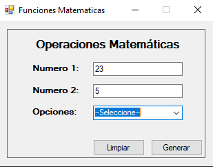

# Funciones Matematicas Básicas

## _Descripción del programa:_
- Programa para realizar las operaciones básica de las matemáticas, realizado en C#

## _Vista del sistema:_

## _Realizado por:_

# Github: @CarlChokSanc

## The MIT License (MIT)

### Este programa o sistema puede ser tomado como guia o enseñanza para sus futuros  proyectos.
Copyright (c) 2021 harlericho
